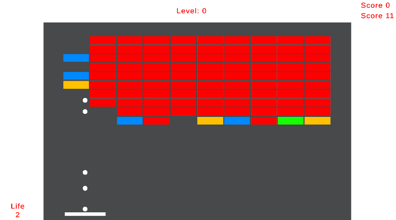

# Arkanodia



## Table of Contents
- [Description](#description)
- [Features](#features)
- [Installation](#installation)
- [Usage](#usage)
- [Gameplay Mechanics](#gameplay-mechanics)
- [Credits](#credits)
- [License](#license)

## Description
Arkanodia is an engaging arcade-style game where players control a character to navigate through various levels filled with blocks and power-ups. The objective is to break blocks, gain points, and reach new levels while avoiding obstacles and collecting rewards.

## Features
- **Dynamic Level Generation:** Each playthrough offers a new experience with randomly generated maps.
- **Power-Ups:** Collect power-ups to enhance your abilities and gain advantages during gameplay.
- **Score Tracking:** Keep track of your score and strive for high scores.
- **Save System:** Save and load your game progress to continue where you left off.

## Installation
1. Clone the repository:
   ```bash
   git clone https://github.com/yourusername/arkonadia.git
   cd arkanodia
2. Open the project in Unity (ensure you have the correct version of Unity installed).
3. Import any necessary packages if prompted.

## Usage
1. Press the Play button in Unity to start the game.
2. Use the arrow keys or AD to move the player character.
3. Collect power-ups to gain temporary advantages.
4. Break blocks to increase your score and progress through levels.
 
## Gameplay Mechanics
- Player Movement: Control the player using keyboard inputs.
- Block Interactions: Break blocks to score points and potentially spawn power-ups.
- Level Progression: Move to the next level by clearing all destructible blocks.

## Credits
Developed by: Jakub Szczyrk

Assets Used: Zenjct, TextMeshPro

## License
This is free and unencumbered software released into the public domain - see the [LICENSE](/LICENSE) file for details.
